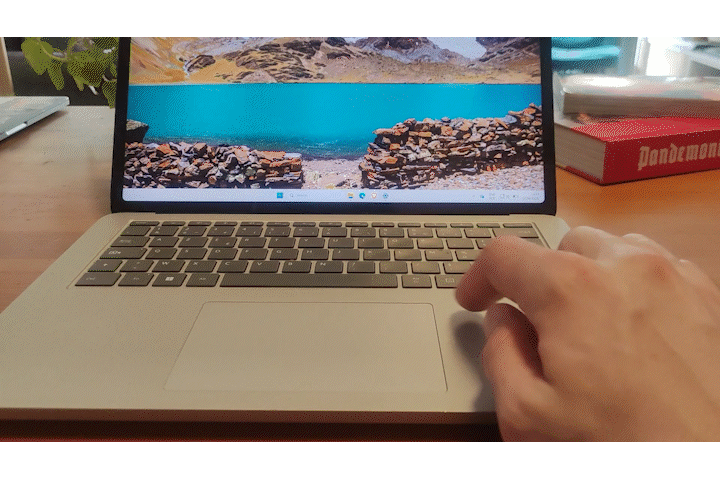

# EdgeSlide

A tiny Windows system-tray utility that turns the **left and right edge strips of your
Precision Touchpad into continuous sliders**:

- **Left strip → screen brightness**
- **Right strip → master volume**

<p align="center">
  
</p>

[](LICENSE)
[](https://github.com/puttingpixelstogether-ops/edgeslide/releases)
[](https://edgeslide.app)

Slide your finger up and down within the outer ~5 mm of the touchpad and the value
follows in real time, with a small on-screen HUD. The rest of the touchpad keeps
working exactly as normal—cursor movement, scrolling and gestures all pass through
untouched.

The app has **no main window**. It lives in the system tray; the settings panel only
appears when you open it. Website: **[edgeslide.app](https://edgeslide.app)**.

---

## Install

1. Download **`EdgeSlide.exe`** from the
   [**Releases page**](https://github.com/puttingpixelstogether-ops/edgeslide/releases/latest).
2. Double-click it. That's it—it appears in your system tray.

It's a single portable file with the .NET runtime bundled in. There's no installer and
nothing else to download.

> **First launch:** because the app isn't code-signed yet, Windows SmartScreen may show
> *"Windows protected your PC."* Click **More info → Run anyway**. This is expected for
> small independent apps, and the warning fades as more people run the same file.

**Requires** a Windows Precision Touchpad on Windows 10 or 11. If you turn on *Launch at
startup*, keep the `.exe` somewhere permanent first—startup remembers wherever the file
currently lives.

---

## What it does

- Reserves the outer left/right strips (default 5 mm, configurable 3–15 mm) of any
  Windows Precision Touchpad as vertical sliders.
- Left strip controls brightness, right strip controls volume (both reassignable, or
  disable either side).
- Top of the touchpad is maximum, bottom is minimum (with an optional invert toggle).
- Shows a slim HUD in the bottom corner while you slide, and hides it when you lift off.
- Single-finger only: two-finger scrolling and other gestures pass straight through.
- Avoids false positives: a gesture only starts if your finger **originated** in the
  edge zone, stayed in the inner strip for a short hold, moved mostly vertically, and
  you weren't just typing.

---

## Settings

Left-click the tray icon (or right-click → **Settings**) to open the panel:

- **Strip width**—3–15 mm, default 5
- **Left edge**—Brightness / Volume / Disabled
- **Right edge**—Volume / Brightness / Disabled
- **Invert direction**—flip it so the top is 0% and the bottom 100%
- **Confirmation hold**—50–300 ms, default 80 (how long your finger must stay in the
  strip before the slider engages)
- **Launch at Windows startup**

Settings persist to `%APPDATA%\EdgeSlide\settings.json`, and a small rolling log is
written to `%APPDATA%\EdgeSlide\edgeslide.log`. Right-click the tray icon for
**Settings**, **Enabled** (toggle on/off), and **Exit**.

---

## Uninstall

Because it's portable, removal is just:

1. Right-click the tray icon → **Exit**.
2. Delete `EdgeSlide.exe`.
3. *(Optional)* delete `%APPDATA%\EdgeSlide` to remove your settings and log.
4. *(If you enabled Launch at startup)* delete the `EdgeSlide` value under
   `HKCU\Software\Microsoft\Windows\CurrentVersion\Run`.

No other system changes are made.

---

## How it works (brief)

| Concern | Approach |
|---|---|
| Touchpad input | **Raw Input** (`RegisterRawInputDevices` + `WM_INPUT`) on the digitizer (usage page `0x0D`, usage `0x05`), with `RIDEV_INPUTSINK` so input arrives even unfocused. |
| Report parsing | `HidP_GetCaps` / `HidP_GetValueCaps` / `HidP_GetUsageValue` / `HidP_GetUsages` from `hid.dll` to extract X, Y, TipSwitch and ContactID per finger. Handles both per-finger and batched multi-contact reports. |
| Brightness | WMI `WmiMonitorBrightnessMethods.WmiSetBrightness`. |
| Volume | CoreAudio via **NAudio** (`MMDeviceEnumerator` → `AudioEndpointVolume.MasterVolumeLevelScalar`). |
| Settings UI | A dark HTML/CSS page hosted in a WebView2 control. |

Source is organised one-concern-per-file: `TouchpadListener` / `ParsedDevice` (input),
`StripGestureDetector` (validation/mapping), `BrightnessController`, `VolumeController`,
`OverlayForm`, `SettingsForm`, `TrayApp`, `Settings`, `NativeMethods`.

---

## Build from source

Requires the **.NET 10 SDK** on Windows (the app uses WinForms and Windows-only
P/Invoke, so it only builds and runs on Windows).

```sh
dotnet build -c Release        # debug/dev build
dotnet run   -c Release        # build and run
```

Convenience scripts:

- **`build-portable.bat`**—produces the standalone `dist\EdgeSlide.exe` (self-contained,
  what ships on the Releases page).
- **`build.bat`**—builds framework-dependent and installs to `%LOCALAPPDATA%\EdgeSlide`
  with a Start Menu shortcut (handy while developing).
- **`packaging/`**—MSIX (Microsoft Store) and NSIS installer builds.

The app runs as a **standard user**; it never requests elevation.

---

## Known limitations

- **Precision Touchpad only.** Older "legacy" touchpads that don't expose a Windows
  Precision Touchpad HID digitizer won't work; the app shows a tray warning and runs in
  a disabled state.
- **Brightness needs a WMI-controllable display.** Many desktops and external-only
  monitor setups return no `WmiMonitorBrightnessMethods` object; brightness control is
  disabled gracefully in that case (volume still works).
- **OEM utilities may compete for input.** Lenovo Vantage, Asus Armoury Crate and
  similar tools also hook the touchpad. If raw-input packets stop arriving, EdgeSlide
  logs a warning rather than crashing.

---

## Support

EdgeSlide is free and pay-what-you-want. If it's useful to you,
[buy me a coffee ☕](https://ko-fi.com/puttingpixelstogether/tip). The privacy policy and
terms live in [`legal/`](legal/).

---

## License

EdgeSlide is open source under the [MIT License](LICENSE)—free to use, modify, and share.
